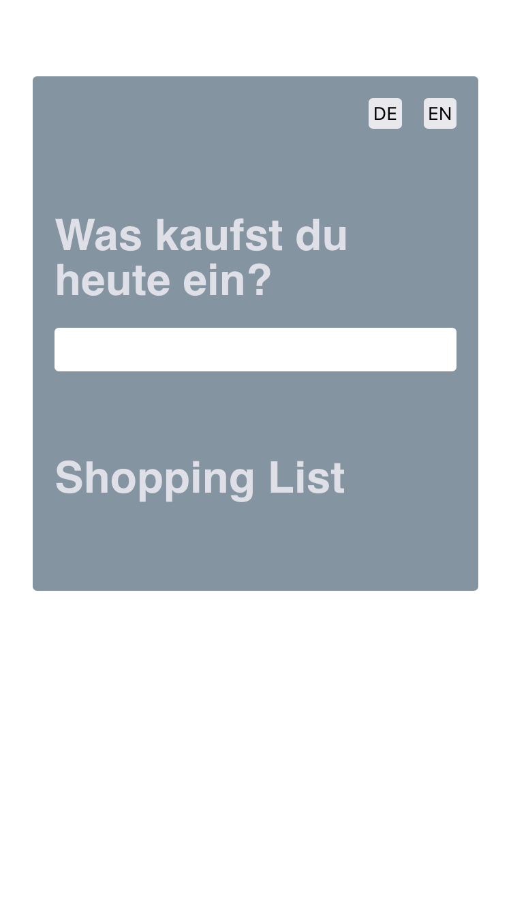
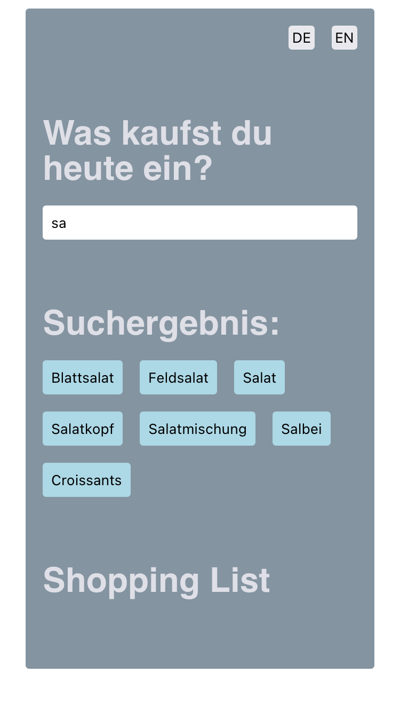
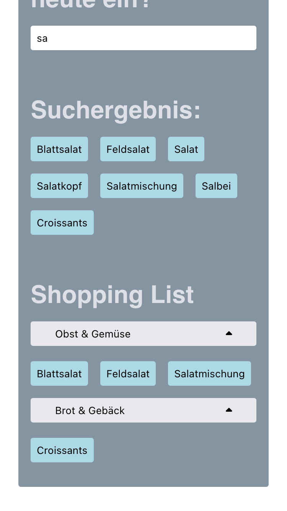
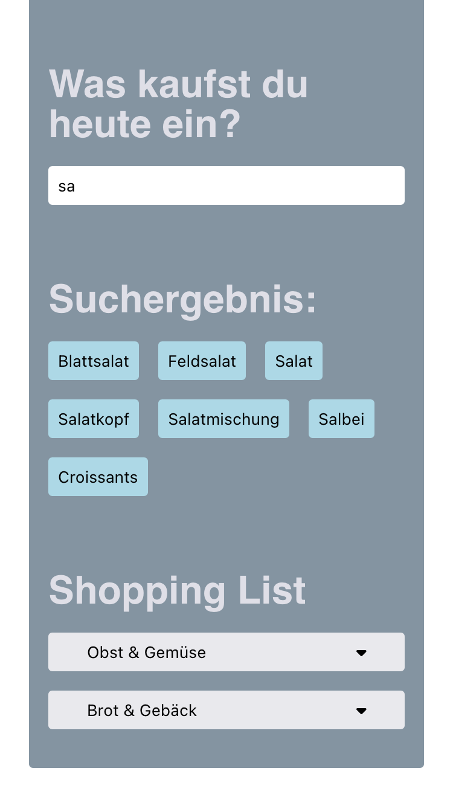

# This is a shopping list base on react.

I fetch the required data from API, filtered the data if there is input in searchbar. Choose items form the filtered data, add them to shopping cart, to the right categories, and every category can be folded or unfolded.

## Use hooks like useEffect, userImmer, useLocalStorage

## Pictures

